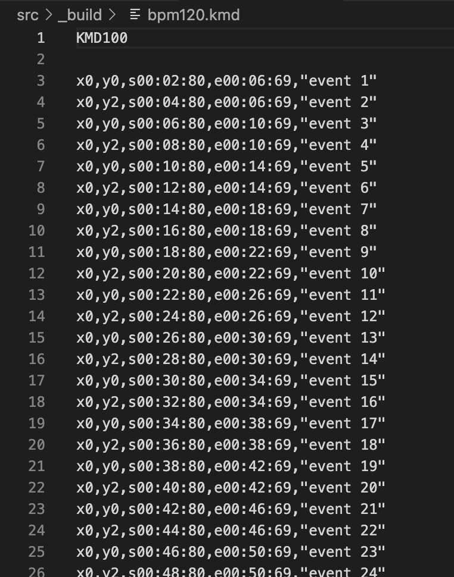

# KMDGEN.X

KMD file template generator for X680x0/Human68k

BPM値その他のパラメータを与えて、KMDファイルのテンプレート(タイムチャート)を自動生成するツールです。
kmdgen.py をCに移植したものになります。

---

### Install

KMDGNxxx.ZIP をダウンロードして展開し、KMDGEN.X をパスの通ったディレクトリに置きます。

---

### How to use

kmdgen.py <total-seconds> <bpm> <beat-interval> <beat-skip> <event-offset> <erase-offset> <out-file>

などとして実行します。

`total-seconds` ... 曲のトータル時間を秒単位で指定します。

`bpm` ... 対象となる曲のBPM(1分間に何拍打つか)を指定します。BPMを知るには、

- [BPMCHK.X](https://github.com/tantanGH/bpmchk) や [aubio](https://aubio.org/)などのツールを使って調べる
- メトロノームアプリやYoutubeのBPM動画などを合わせて再生して自分で調べる
- スマホアプリやWebの無料サービスなどを使って調べる。 

などの方法があります。自分は macOSで aubio を使っています。
BPMCHK.X は aubio ライブラリをS44対応改造し、x68k向けにコンパイルしてBPM算出に特化したツールです。

いくつかテンプレートをBPMをずらして作ってみて再生し、しっくりくるものをベースに編集に入るのも良いと思います。
出力されたテンプレートはダミーメッセージが入っていますがそのまますぐに SMR.X / MP3EXP.X で再生可能です。

`beat-interval` ... 何拍ごとにKMDのイベント行を出力するかの指定。イベントは y0 → y2 → y0 → y2 → ... のように、y位置が交互に繰り返す形で出力されます。y1 の出力はされません。

`beat-skip` ... 歌詞表示イベント行の出力を曲の出だしの何拍分スキップするかの指定。イントロ部分を飛ばしたいときなど。

`event-offset` ... 歌詞表示は通常拍ぴったりではなく、やや前にすることが多いです。拍の何tick前にstを設定するかのオフセット指定です。1tickは10msec(KMDの最小時間単位)です。

`erase-offset` ... 歌詞表示を消すタイミング(et)は、次のy0イベントのstの1tick前がデフォルトになります。このオフセットを指定するとさらにそれよりも指定したtick分だけ前にetを設定します。

`out-file` ... 出力先のKMDファイル名です。既にファイルが存在する場合は上書きするかの確認を求められます。

実行例：

    kmdgen 180 120 4 6 20 10 bpm120.kmd

180秒・120BPMの曲に対して4拍ごとにイベント行を出力。最初の6拍についてはスキップしイベントの出力は行わない。イベントはそれぞれの拍の20ticks(200msec)前を開始時間(st)とする。各イベントの消去時刻(et)は次のy0イベントの 10+1=11ticks(110msec)前とする。結果はbpm120.kmdに書き出す。

---

### License

MIT License

---

### Special Thanks

* KMDの技術情報およびサンプルデータ提供 thanks to かきうちさん / X68PROさん 
* xdev68k thanks to ファミべのよっしんさん
* HAS060.X on run68mac thanks to YuNKさん / M.Kamadaさん / GOROmanさん
* HLK301.X on run68mac thanks to SALTさん / GOROmanさん
* XEiJ thanks to M.Kamadaさん

---

### History

* 0.1.0 (2023/03/02) ... 初版